# 16-bit MCU Emulator

This project is a Verilog implementation of a 16-bit CPU, designed for emulation and simulation using Vivado. The CPU is built from the ground up, starting with basic logic gates and culminating in a functional ALU, registers, and RAM.

## Project Structure

The Verilog source files are located in the `MCU_emulator.srcs/sources_1/new/` directory. The project is organized hierarchically, with the top-level module being `CPU.v`.

### Key Modules

*   **CPU.v:** The top-level module that integrates all the components of the CPU.
*   **ALU.v:** The Arithmetic Logic Unit, which performs arithmetic and logical operations.
*   **Register.v:** A 16-bit register used for the A and D registers.
*   **PC.v:** The Program Counter, which keeps track of the next instruction to be executed.
*   **RAM16K.v:** A 16K RAM module, which is built from smaller RAM modules.
*   **And.v, Or.v, Not.v, Xor.v:** Basic logic gates.
*   **Add16.v, And16.v, Not16.v, Or16.v:** 16-bit versions of the basic logic gates.
*   **Mux.v, Mux16.v, Mux4Way16.v, Mux8Way16.v:** Multiplexers of various sizes.
*   **DMux.v, DMux4Way.v, DMux8Way.v:** Demultiplexers of various sizes.
*   **HalfAdder.v, FullAdder.v:** Basic building blocks for the adder.
*   **Inc16.v:** A 16-bit incrementer.
*   **Bit.v, DFF.v, D_Latch.v:** Basic memory elements.

## From RTL to CPU: A Step-by-Step Implementation

### 1. Elementary Logic Gates: The Foundation

The CPU is built upon a foundation of elementary logic gates. These are the most basic building blocks, from which all other components are constructed.

#### Basic Gates

These are the fundamental logic gates that perform boolean operations.

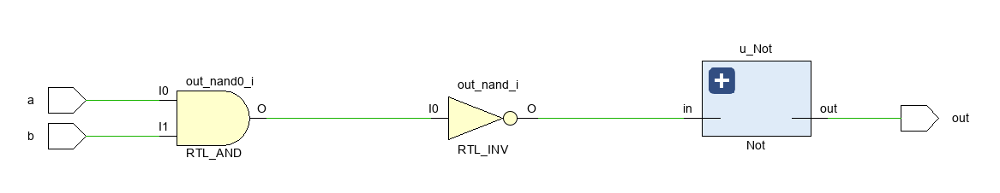

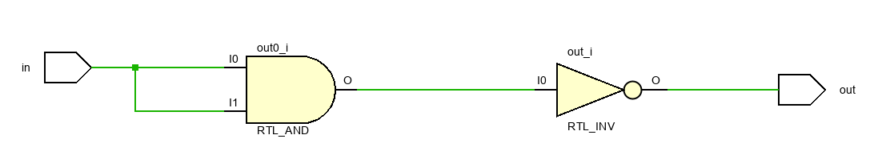
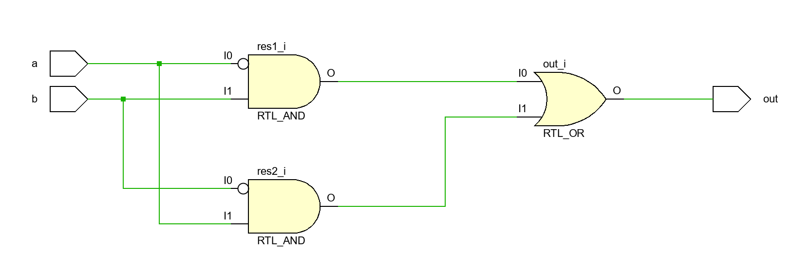

#### 16-Bit Variants

To handle 16-bit data, we create 16-bit versions of the basic gates.

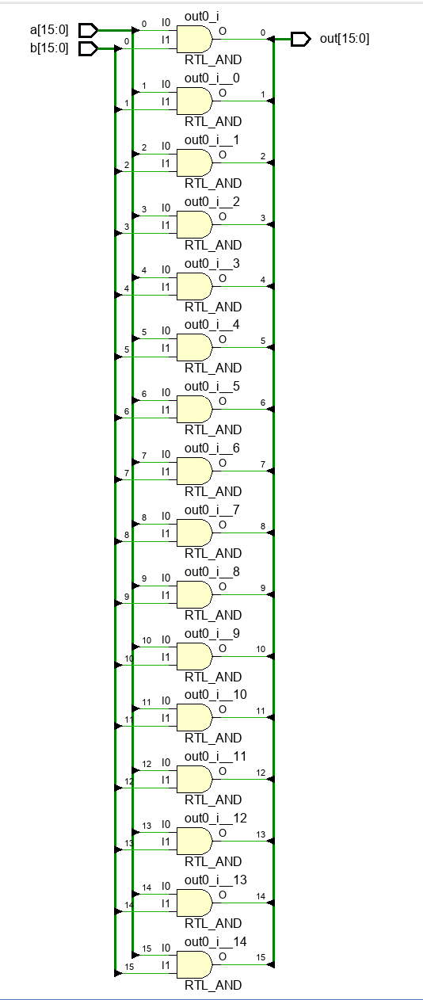
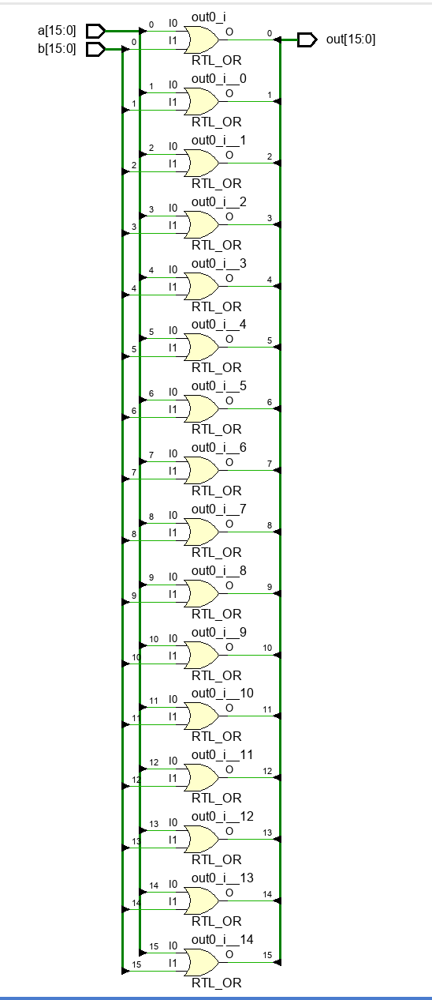
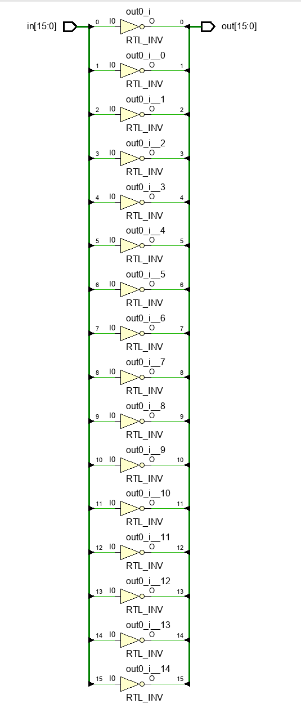

#### Multiplexers and Demultiplexers

Multiplexers (Mux) and Demultiplexers (DMux) are used to select and route data within the CPU.

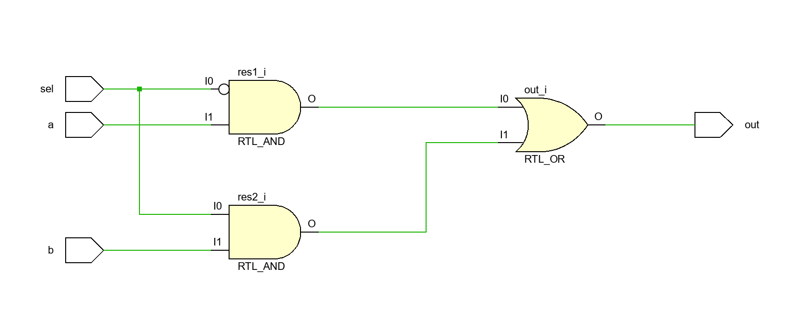
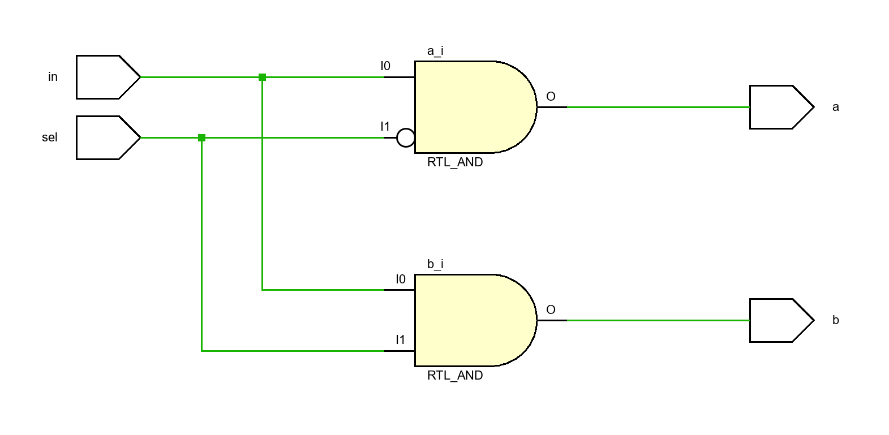

We also have multi-way variants for more complex routing.

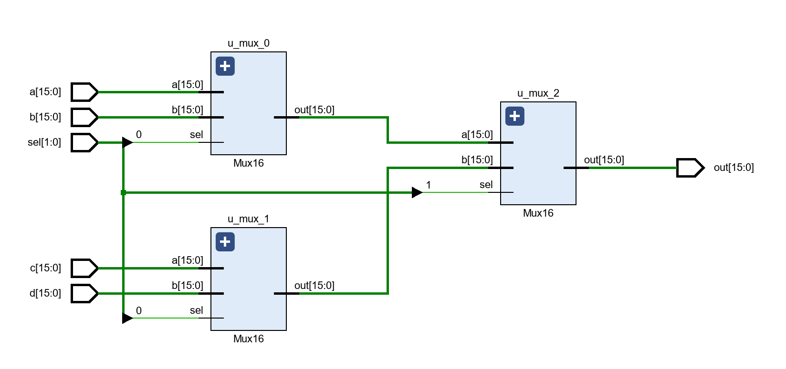
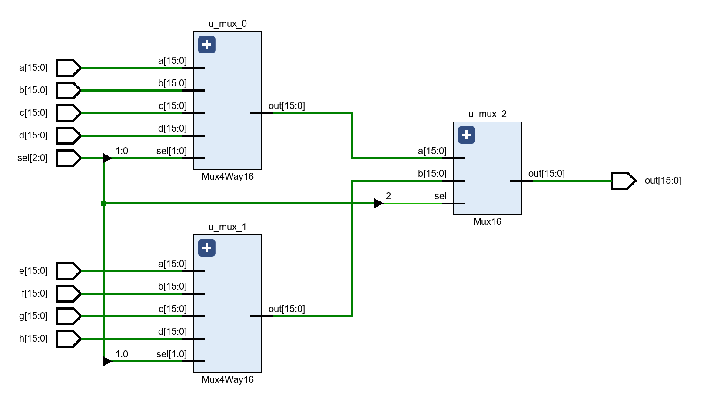
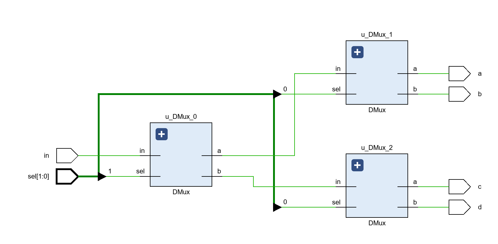
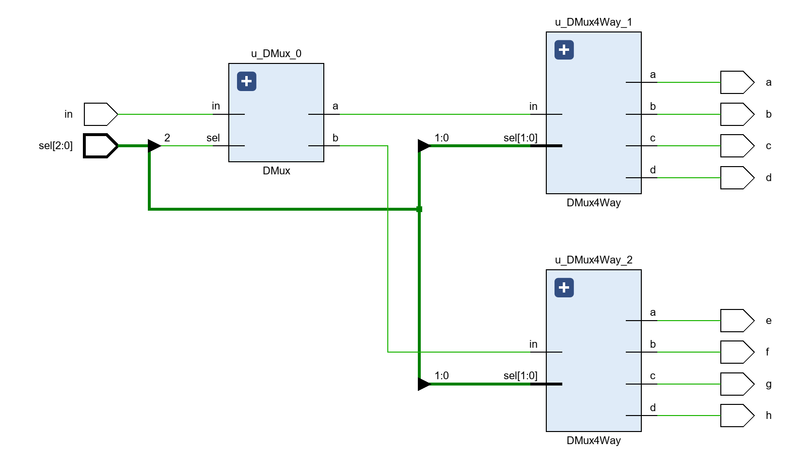

### 2. Arithmetic Logic Unit (ALU): The Brains of the Operation

The ALU is responsible for performing arithmetic and logical operations. It is constructed from the elementary gates.

#### Building Blocks of Addition

The foundation of our ALU's arithmetic capabilities is the adder.

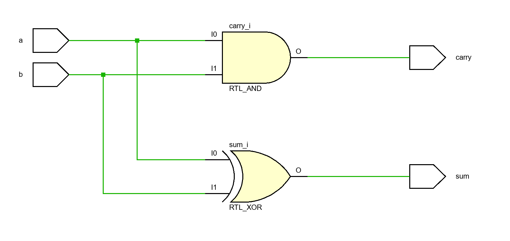
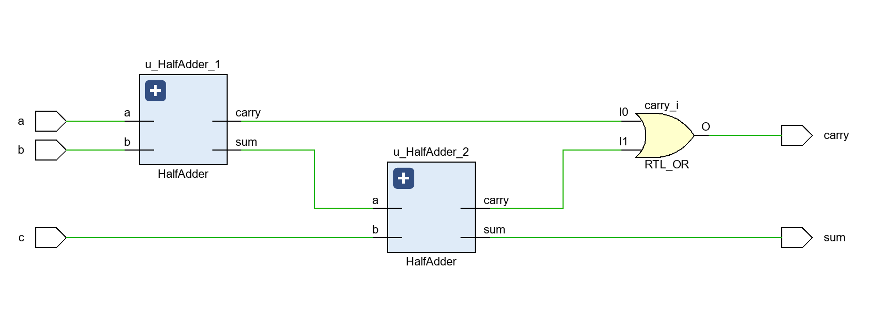

These are combined to create a 16-bit adder and a 16-bit incrementer.

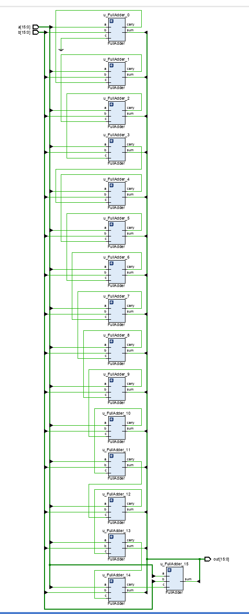
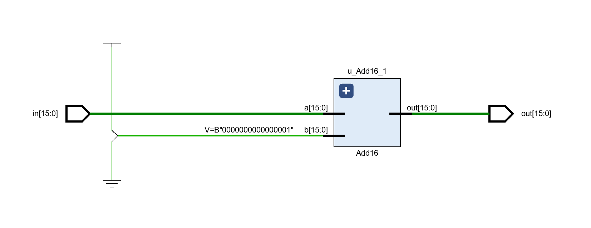

#### The Complete ALU

The final ALU combines these components to perform a variety of operations based on a set of control bits. The specification below details the operations the ALU can perform.

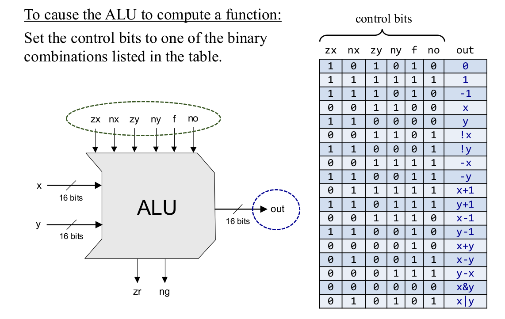
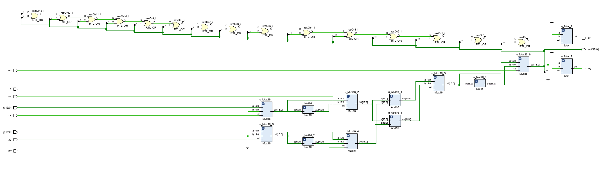
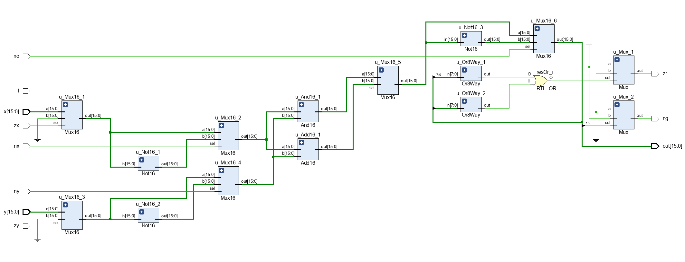

### 3. Memory: Storing the Data

The CPU needs memory to store data and instructions. We build our memory system from the ground up, starting with the most basic memory element.

#### The D-Latch and D-Flip-Flop (DFF)

The D-latch is a basic memory element, but it has a "transparency" issue. The D-Flip-Flop (DFF) solves this by being edge-triggered.

/D_latch-nand.png)

##### D-Latch vs. DFF

*   **D-latch:** Has a race-around problem. When the clock is high, the output Q changes with the input D (level-sensitive).
    /wave/D_latch.png)
*   **D-Flip-Flop (DFF):** Solves the race-around problem. It is rising-edge sensitive and has asynchronous set and reset capabilities.
    /wave/DFF.png)

Here is the positive-edge-triggered DFF used in this project:
/DFF_posedge.png)

#### Registers

Registers are used to store data within the CPU. They are built from DFFs.

/Register.png)
/Register_full.png)

#### RAM

The RAM is built hierarchically from smaller RAM modules.

/RAM8.png)
/RAM64.png)
/RAM512.png)
/RAM4K.png)
/RAM16K.png)

#### Program Counter (PC)

The Program Counter keeps track of the next instruction to be executed.

/PC.png)

### 4. The CPU: Putting It All Together

Finally, we integrate the ALU, registers, RAM, and PC to create the complete CPU.

#### CPU Architecture

The following diagram shows the architecture of our 16-bit CPU.

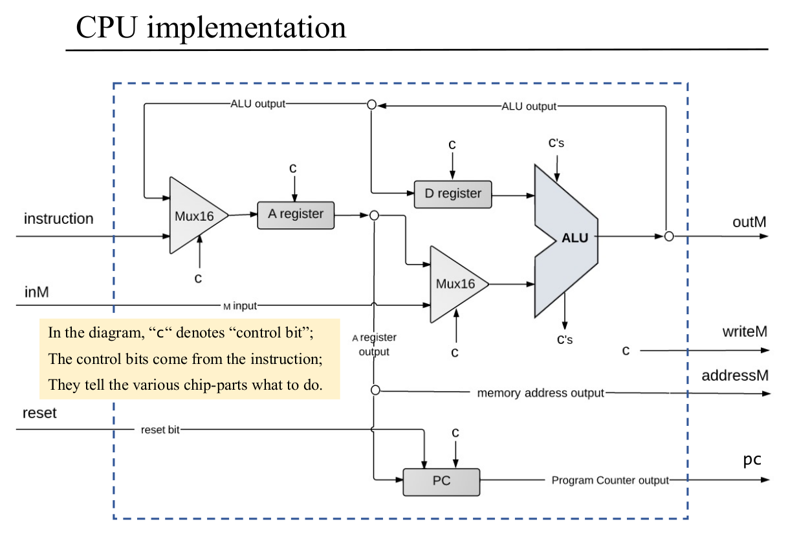
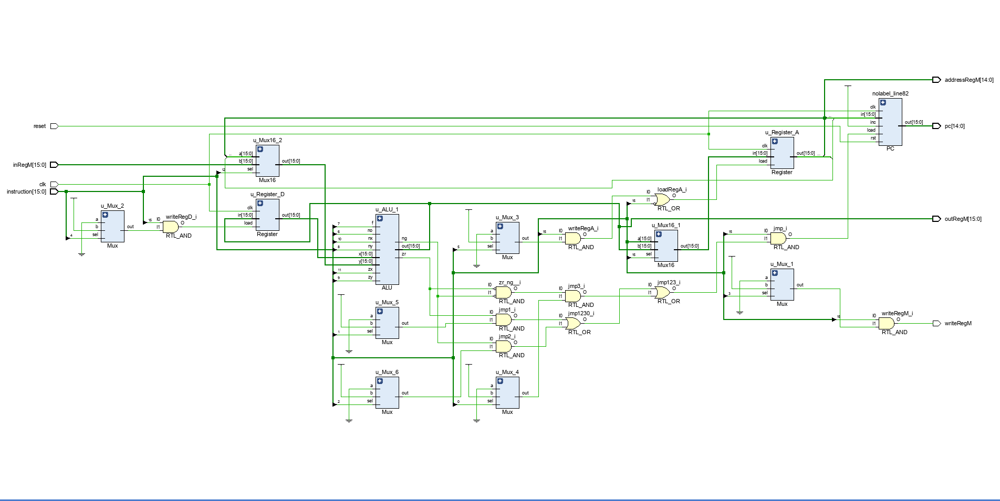

#### Machine Language

The CPU understands a specific machine language, as defined in the following specification.

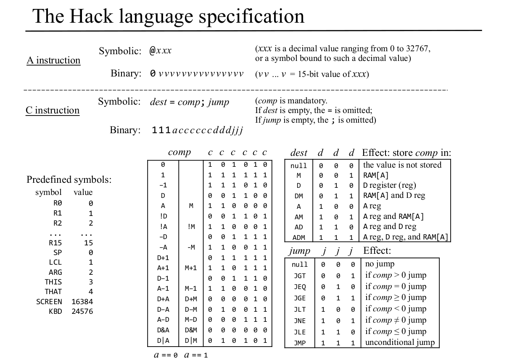

## How to Use

This project is intended to be used with Vivado. To simulate the CPU, you will need to create a testbench that provides a clock signal, a reset signal, and a stream of instructions. The output of the CPU can be observed in the Vivado simulator.

## Further Development

This project provides a solid foundation for a 16-bit CPU. Here are some potential areas for further development:

*   **Instruction Set Documentation:** Create a document that formally defines the instruction set.
*   **Assembler:** Write an assembler that can convert assembly code into machine code that can be executed by the CPU.
*   **Compiler:** Write a compiler for a high-level language that can target this CPU.
*   **Peripherals:** Add peripherals such as a UART, timers, and GPIO to the CPU.
